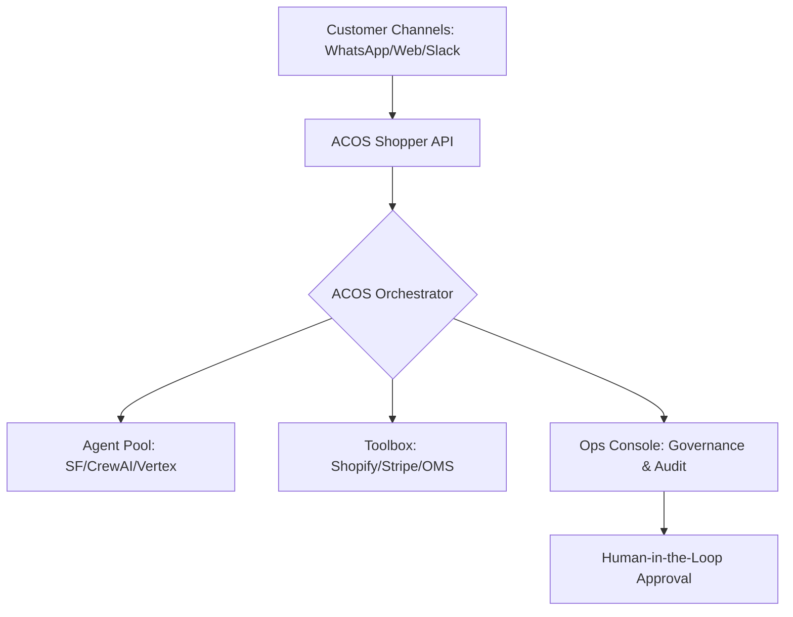

<div align="center">
  
  <h1>Agentic Commerce OS (ACOS)</h1>
  <p><b>The Federated Control Plane for Governed AI Retail & Service Operations</b></p>

  [](https://github.com/rastogivaibhav/AgenticCommerceOS)
  [](./LICENSE)
  [](./CHANGELOG.md)
  [](https://www.python.org/)
  [](./docker-compose.yml)

  <p>
    <a href="#-the-mission">Mission</a> •
    <a href="#-architecture">Architecture</a> •
    <a href="#-federated-agents">Federated Agents</a> •
    <a href="#-quick-start">Quick Start</a> •
    <a href="#-governance">Governance</a>
  </p>
</div>

---

## 🎯 The Mission

**ACOS** is not a chatbot. It is the **Operating System** for the future of commerce. 

In an era where customer journeys are fragmented across WhatsApp, Slack, Web, and Voice, and intelligence is scattered across Salesforce, CrewAI, and custom LLMs, ACOS provides the **Unified Control Plane**. It allows enterprise operations teams to design, approve, and orchestrate agentic workflows with the same rigour as traditional software.

> *"ACOS bridges the gap between 'Experimental AI' and 'Production Commerce'."*

---

## 🏛️ Architecture: The Hub-and-Spoke Model

ACOS sits at the intersection of customer channels, AI runtimes, and enterprise ERPs.



### Core Components
- **Shopper API**: High-throughput runtime for journey execution.
- **Ops API & UI**: The Governed Control Plane for workflow promotion and replay.
- **ADK Runtime**: A unified provider abstraction for NVIDIA NIM, Google GenAI, and Local LLMs.
- **MemoryV2**: A semantic state-management layer for cross-agent context sharing.

---

## 🤖 Federated Agents: Unified Interoperability

ACOS is the first platform designed to orchestrate **Foreign Agents** as first-class citizens. One registry to rule them all.

| Agent Type | Platform | Role |
| :--- | :--- | :--- |
| **Agentforce** | Salesforce | CRM Deep-Dive & Case Resolution |
| **CrewAI Swarms** | Custom | Strategic Multi-Agent Reasoning |
| **Stripe Agent** | Stripe | Transactional Integrity & Fraud Logic |
| **Vertex Agents** | Google Cloud | Native A2A Protocol Interop |

---

## ⚡ Quick Start: Zero-Touch Deployment

Experience the power of ACOS in under 2 minutes.

```bash
# 1. Clone the Federated Backbone
git clone https://github.com/rastogivaibhav/AgenticCommerceOS.git
cd AgenticCommerceOS

# 2. Configure Environment
cp .env.example .env

# 3. Launch the Stack
docker compose up --build -d

# 4. Bootstrap the Estate
python bootstrap.py
```

Visit the Ops Console at `http://localhost:8000/ui/` to see your agents in action.

---

## 🛡️ Governance & Enterprise Readiness

ACOS was built for the Enterprise Review Board (ARB). Every action is guarded by three pillars:

1. **The Fast-Path/Slow-Path Model**: Reasoning is agentic; execution is deterministic. No hallucinations in your checkout flow.
2. **JWT-Scoped Tool Access**: Agents only get permissions for the tools they need, for the duration of the trace.
3. **Kill-Switch Thresholds**: Automated monitoring of cost and latency. If an agent (like CrewAI) exceeds its budget, ACOS automatically reverts to the **Deterministic Fallback**.

---

## 🗺️ Roadmap: The Journey to Autonomous Commerce

- [x] **v1.0 (GA)**: Federated Agent Registry, MemoryV2, and NVIDIA NIM Integration.
- [ ] **v1.1**: Native MCP (Model Context Protocol) Support for all retail connectors.
- [ ] **v1.2**: Advanced Data Lineage Tracking for Inter-Agent Memory.
- [ ] **v1.5**: Autonomous Workflow Optimization based on Quality Scores.

---

## 🤝 Contributing

We are building the future of commerce. Join us.
See [CONTRIBUTING.md](./CONTRIBUTING.md) for details on our development process and standards.

---

<div align="center">
  <sub>Built with ❤️ by the ACOS Engineering Team. Licensed under Apache 2.0.</sub>
</div>
